<p align="center">
  
</p>

<p align="center">
  
  
  
  
  
</p>

# AI_Office

> An office suite — **Sheets, Docs, and Slides** — built from scratch in
> TypeScript + React, for **self-learning and educational purposes only**: to
> expose the skeleton of the world's most-used software so anyone can study
> it, learn from it, and build the next floor.

AI_Office is **not** a Microsoft 365 clone and claims no feature parity. It is
a genuinely useful core suite with a deep, well-tested spreadsheet engine.
Every intentional limitation is written down in
[`KNOWN_LIMITS.md`](./KNOWN_LIMITS.md) — nothing is hidden.

## 📚 Start here — the guided tour

| Read this | To learn |
|---|---|
| 🦴 [**The Anatomy**](./docs/ANATOMY.md) | How a spreadsheet *actually* works inside — tokenizer → parser → evaluator, dependency graphs, virtualization — with diagrams, using this repo's real code |
| ⚖️ [**vs Microsoft**](./docs/VS_MICROSOFT.md) | The honest ledger: what an advanced AI replicated in days, what Microsoft still does better, and *why* those moats exist |
| 🔐 [**Security**](./docs/SECURITY.md) | The threat model of a local-first office app — what's mitigated, what's inherent, what's on the roadmap |
| 🎨 [**UI/UX foundations**](./docs/UI_UX_FOUNDATIONS.md) | The design system, module accents, command patterns, accessibility contract, responsive rules, and honest next steps |
| 🤖 [**AI Integration**](./docs/AI_INTEGRATION.md) | How a Copilot-style assistant would bolt onto this architecture (design exploration, with real API costs) |
| 🐛 [**BUGLOG**](./BUGLOG.md) | Every bug found, from Phase 1 to today — symptom, root cause, fix, guarding test |
| 🗺️ [**Build plan**](./docs/PHASE0_PLAN.md) & [**Final audit**](./docs/PHASE7_REPORT.md) | How the project was planned, phased, and adversarially audited |

---

## ✨ Features

| Area | What works today |
|------|------------------|
| **Formula engine** | Excel-style precedence (`-2^2 = 4`), `$A$1` absolute refs, ranges, error codes (`#DIV/0!`, `#REF!`, `#VALUE!`, `#NAME?`, `#N/A`, `#NUM!`, `#CYCLE!`) that propagate through references and ranges, and cycle detection. **Point mode**: while typing a formula, click a cell to insert its reference (drag for a range), exactly like Excel. |
| **144 functions** | Math & trig, statistics (`SUMIFS`/`COUNTIFS`/`AVERAGEIFS`/`MAXIFS`/`MINIFS`, `LARGE`/`SMALL`/`RANK`/`MODE`/`PERCENTILE`/`QUARTILE`), text (`TEXTJOIN`, `CHAR`, `CLEAN`…), logical & info (`IFS`, `SWITCH`, `ISBLANK`/`ISNUMBER`/`ISERROR`…), lookup (`XLOOKUP`, `VLOOKUP`/`HLOOKUP`/`INDEX`/`MATCH`), date & time (`TODAY`, `NOW`, `EDATE`, `DATEDIF`, `WEEKNUM`, `TIME`/`HOUR`/`MINUTE`/`SECOND`) — plus friendly aliases like `AVG` and modern dotted names (`STDEV.S`). |
| **Grid** | Virtualized rendering (smooth at 200×52 and beyond), mouse + keyboard selection, inline editing, column resize, freeze header row/column. |
| **Editing** | Full shortcut set — copy/cut/paste, undo/redo (100 steps), bold/italic/underline, select-all, AutoSum (`Alt+=`), `F2`, `Tab`/`Enter`/`Esc`/`Delete`. **Fill handle**: drag the little square at the selection corner to copy cells, extend number series (1, 2 → 3, 4, 5…), and re-anchor formulas — in all four directions. |
| **Formats** | Number formats including **₹ Indian (lakh/crore)** grouping, percent, currency, thousands. |
| **Sheets** | Multiple sheets with tabs (add / rename / delete). |
| **Ribbon** | Excel-style tabbed ribbon — **Home** (clipboard, font, alignment, number format, cells, editing), **Insert** (PivotTable, Chart), **Data** (sort, find & replace, PivotTable, Chart), **View** (freeze, macros, help). |
| **Data** | Sort, find & replace, insert/delete rows & columns with reference rewriting. |
| **PivotTable** | Summarize a selected range into a new sheet — group by a row (and optional column) field and aggregate a value field (sum / count / avg / min / max) with grand totals. |
| **Open / Save As** | File → **Open** recognizes `.aioffice` projects, Excel `.xlsx`/`.xls`/`.xlsm`, and `.csv`/`.txt`/`.tsv` from your PC; File → **Save As** writes an `.aioffice` project, an Excel `.xlsx`, or a `.csv`. (No separate import/export buttons — it all lives in the File menu.) |
| **Charts** | Basic line / bar chart builder from a selected range. |
| **Macros** | JavaScript, Office-Scripts style, with a documented `sheet` API — **never** VBA. See [`docs/MACRO_API.md`](./docs/MACRO_API.md). |
| **Documents** | Rich-text editor (TipTap) with a ribbon — styles/headings, font, bold/italic/underline, lists, alignment, insert table/image/link — a page-styled canvas, live word count, and Word-style **Save As: `.docx`, `.md`, `.html`, `.txt`** plus print-to-PDF. |
| **Cloud (planned)** | Google Drive save/open is fully designed — least-privilege `drive.file` scope, no server of ours — see [`docs/GOOGLE_DRIVE.md`](./docs/GOOGLE_DRIVE.md); needs only a free OAuth Client ID to wire up. |
| **Presentations** | Slide deck editor — title/body/image layouts, four themes, **drag-to-reorder** slide list, speaker notes, **full-screen present mode** with keyboard nav, and export the deck to PDF. |
| **App shell** | An original, module-coloured desktop shell; consistent local SVG commands; contextual Sheets/Docs/Slides toolbars; a structured **File menu** (New / Open / Save As); shared accessible dialogs; and honest local-save status. In-app Help lists only shortcuts that actually work — a **build-time audit fails the build** if Help and the key handler diverge. Responsive down to 360px. |
| **Persistence** | Autosaves the workbook, the document, and the slide deck to the browser (localStorage); one `.aioffice` file saves/opens all three modules together. |

---

## 🚀 Quick start

**Prerequisites:** [Node.js](https://nodejs.org/) 20 or newer.

```bash
# 1. Install dependencies
npm install

# 2. Start the app in development mode
npm run dev
```

Then open the URL printed in the terminal (default **http://localhost:3000**).

## 📦 Every way to run AI_Office

| Mode | Command | What you get |
|------|---------|--------------|
| **Dev server** | `npm run dev` | Hot-reload development at `http://localhost:3000`. |
| **Production build** | `npm run build` | Static site in `dist/` (type-check + Help audit run first). |
| **LAN server** | `npm run build && npm run serve:lan` | Serves `dist/` at `http://<this-pc-ip>:8080` for other PCs/phones on the network. (`python -m http.server 8080` from inside `dist/` works too.) |
| **Single offline file** | `npm run build:single` | `dist-single/AI_Office.html` — one ~1.4 MB file with everything inlined. Copy it anywhere and **double-click**; no install, no server, works fully offline. |
| **Install as an app (PWA)** | serve `dist/` over http(s), open in Chrome/Edge | The browser offers **“Install app”** (desktop) / **“Add to Home screen”** (Android/iOS). Works offline after the first visit — the service worker caches the app. |
| **Windows desktop (.exe)** | `npm run dist:win-arm64` or `dist:win-x64` **on a Windows machine** | Portable `AI_Office.exe` in `release/`. See [`BUILD_ON_WINDOWS.md`](./BUILD_ON_WINDOWS.md) — the cloud build environment cannot download Electron's binaries, so this one step runs on your PC. |

> Honest note: the PWA's offline behaviour was verified functionally (service
> worker active + the app reloads and computes while the network is off). A
> Lighthouse PWA score was not run in this environment.

---

## 🧪 Testing

```bash
npm test          # run all unit tests (Vitest)
npm run coverage  # unit tests with a coverage report
npm run lint      # type-check with the TypeScript compiler
npm run e2e       # end-to-end browser tests (Playwright)
```

- **An extensive unit suite (300+ tests)** covers the formula engine, grid operations, CSV/XLSX, the
  document model, the slide deck, the whole-suite project format, 10k-cell
  performance, and the app store (including a feature-by-feature audit, the
  Help↔keybinding audit, and stale-state edge cases).
- **Playwright E2E tests (25+)** cover the Sheets flow (edit → formula → insert row →
  undo → export, freeze, macros, help), the Docs flow (type → format → insert
  table → export `.docx`), the Slides flow (create → reorder → present → exit),
  the File menu (save/new), a **keyboard-only accessibility** walkthrough, a
  **responsive audit** at 360/768/1366px, and three click-through **audits**
  that fail on any uncaught runtime error.
- `npm run build` runs the **Help↔keybinding audit** and fails if the in-app Help
  ever advertises a shortcut the handler doesn't implement (or vice-versa).

> First-time E2E users may need browsers: `npm run e2e:install`.

---

## 📁 Project structure

```
src/
├── engine/                 # Framework-agnostic spreadsheet engine (no React)
│   ├── formula/            #   tokenizer → parser → evaluator, 144 functions
│   ├── grid/               #   workbook, sheet, mutations, sort/fill/find
│   ├── format/             #   number formatting (incl. ₹ Indian grouping)
│   └── macro/              #   sandboxed JS macro runtime + sheet API
├── io/                     # CSV, XLSX, .docx, and .aioffice serialization
└── ui/                     # React application
    ├── state/              #   spreadsheet store (undo/redo, selection, autosave)
    ├── components/         #   Grid, SheetsRibbon, FormulaBar, tabs, modals (chart/pivot/macro/help)
    ├── sheets/             #   Sheets workspace (keyboard, wiring)
    ├── docs/               #   Docs editor (TipTap) + ribbon
    ├── slides/             #   Slides deck editor + present mode
    ├── shell/              #   File menu (whole-suite New/Open/Save)
    └── keybindings.ts      #   shortcut registry (Help + build audit)
e2e/                        # Playwright end-to-end tests
docs/                       # Architecture plan and macro API reference
```

The **engine is deliberately independent of React** — it is pure TypeScript,
fully unit-tested, and could be reused outside this app.

**Why TipTap for the document editor?** The editor is built on
[TipTap](https://tiptap.dev/) (a maintained wrapper over ProseMirror) rather than
the deprecated `document.execCommand`. TipTap gives a structured, well-tested
document model (clean JSON we convert to `.docx`), predictable cross-browser
behaviour, and first-class extensions for tables, links, and images — none of
which `execCommand` reliably provides.

---

## 📜 Available scripts

| Script | What it does |
|--------|--------------|
| `npm run dev` | Start the Vite dev server with hot reload. |
| `npm run build` | Type-check, run the Help audit, and build into `dist/`. |
| `npm run build:single` | Build the standalone `dist-single/AI_Office.html`. |
| `npm run preview` | Serve the production build locally. |
| `npm run serve:lan` | Serve the production build on the local network (port 8080). |
| `npm run dist:win-x64` / `dist:win-arm64` | Build the Windows portable `.exe` (run on Windows — see `BUILD_ON_WINDOWS.md`). |
| `npm test` | Run the unit-test suite once. |
| `npm run test:watch` | Run unit tests in watch mode. |
| `npm run coverage` | Unit tests with coverage. |
| `npm run lint` | Type-check only (no emit). |
| `npm run e2e` | Run Playwright end-to-end tests. |

---

## 🗺️ Roadmap

This project is being built in phases:

- ✅ **Phase 0** — Architecture & plan ([`docs/PHASE0_PLAN.md`](./docs/PHASE0_PLAN.md))
- ✅ **Phase 1** — Spreadsheet engine (formula / grid / macro)
- ✅ **Phase 2** — Sheets UI
- ✅ **Phase 3** — Document editor
- ✅ **Phase 4** — Presentation editor
- ✅ **Phase 5** — App shell, in-app help, persistence
- ✅ **Phase 6** — Packaging: LAN serve, single-file HTML, PWA, Electron config
- ✅ **Phase 7** — Adversarial audit & polish — see [`docs/PHASE7_REPORT.md`](./docs/PHASE7_REPORT.md)

**All seven phases are complete.** Remaining ideas live in `KNOWN_LIMITS.md`.

See [`KNOWN_LIMITS.md`](./KNOWN_LIMITS.md) for what is intentionally out of scope,
and [`BUGLOG.md`](./BUGLOG.md) for the running record of bugs found and fixed.

---

## 🤝 Contributing

This is a personal learning project. If you'd like to explore or extend it, see
[`CONTRIBUTING.md`](./CONTRIBUTING.md).

## 📄 License

[MIT](./LICENSE) — free to use, learn from, and build upon.
