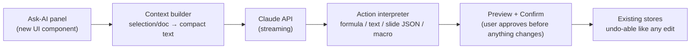

# 🤖 AI Integration — the Copilot exploration

> Microsoft ships Copilot inside Office; Anthropic's Claude powers assistants
> in many products. This document explores — **design only, nothing implemented
> yet** — how AI_Office could grow the same kind of assistant, what it would
> cost, and what the honest trade-offs are.

## What "Copilot for AI_Office" would actually do

| Module | Feature | How it works under the hood |
|---|---|---|
| **Sheets** | *"Sum production for wells above 3000 psi"* → formula | Send the sheet's header row + the request to Claude; it returns `=SUMIF(B2:B50,">3000",G2:G50)`; user confirms before insert |
| **Sheets** | Explain a formula / an error | Send the formula + referenced values; get a plain-language explanation of why `#REF!` appeared |
| **Sheets** | Analyze a selection | Send the selected range as CSV; Claude returns trends, outliers, and a chart suggestion (e.g. "motor temp correlates with frequency; flag rows 12, 31") |
| **Docs** | Draft / rewrite / summarize | Send the document text (or selection) with an instruction; stream the rewrite into the editor for review |
| **Slides** | *"Turn this doc into 5 slides"* | Send the doc, ask for structured JSON (title/body per slide), pipe straight into the deck store |
| **Macros** | Natural language → macro | Claude writes JavaScript against our documented `sheet` API — the macro runtime becomes the safe execution layer |

The last row is the key architectural insight: **we already built the hard
part.** A documented, sandboxed `sheet` API is exactly the "tool" an AI needs.
Copilot in Excel works the same way — the model doesn't touch cells directly;
it calls constrained APIs.

## Architecture sketch

Design rules that keep it safe and honest:

1. **Preview-then-apply.** AI output lands as a proposal; applying it goes
   through the normal store mutation, so **undo works on AI actions**.
2. **Send the minimum.** Only the selection/relevant range leaves the machine,
   never the whole workbook by default — and the UI says exactly what is sent.
3. **Structured outputs.** Slide generation and formula suggestions use the
   API's JSON-schema output mode, so responses are machine-checkable rather
   than parsed from prose.
4. **BYO key, or a tiny proxy.** A browser app can't ship a secret API key.
   Either the user pastes their own key (stored locally, educational use), or
   a ~50-line serverless proxy holds the key and rate-limits. That proxy is the
   only server this project would ever need.

## Models and realistic costs (Claude API, mid-2026)

| Model | ID | Best for | Price (per million tokens in/out) |
|---|---|---|---|
| Claude Opus 4.8 | `claude-opus-4-8` | Default — analysis, drafting, macro-writing | $5 / $25 |
| Claude Sonnet 5 | `claude-sonnet-5` | High-volume assist at lower cost | $3 / $15 |
| Claude Haiku 4.5 | `claude-haiku-4-5` | Instant formula help, autocomplete-grade | $1 / $5 |

Back-of-envelope: a formula suggestion is ~500 input + ~100 output tokens — a
fraction of a cent even on Opus. A full-document rewrite (10k tokens each way)
is ~$0.30 on Opus, ~$0.05 on Haiku-class. An individual exploring this spends
coffee money, not cloud budgets. (Prices move; check platform.claude.com.)

## Why this isn't built yet (honest sequencing)

An assistant bolted onto a weak foundation is a demo; bolted onto a tested
engine it's a feature. Phases 1–7 built the foundation and its audits first —
exactly so that when an AI writes a formula or a macro into the grid, the
engine underneath computes it correctly, undo protects the user, and the
sandbox contains it. This document exists so the next builder (us, or anyone
who forks the repo) starts with the architecture instead of the guesswork.
