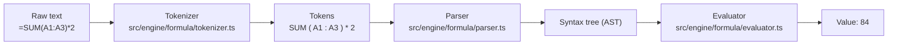
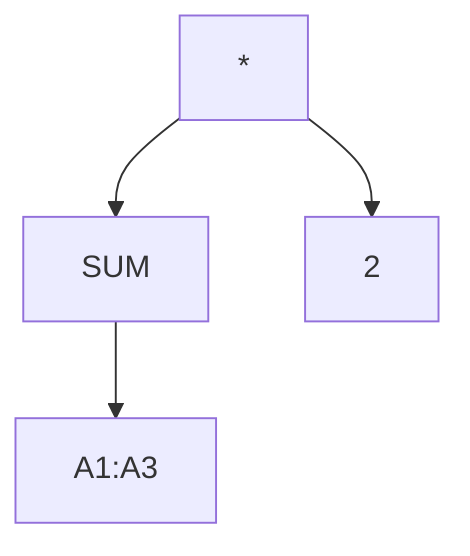
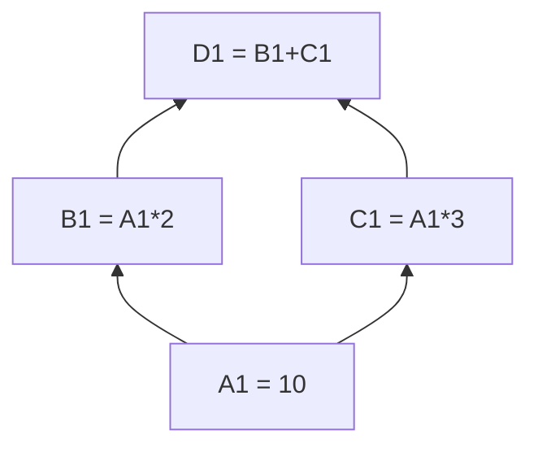
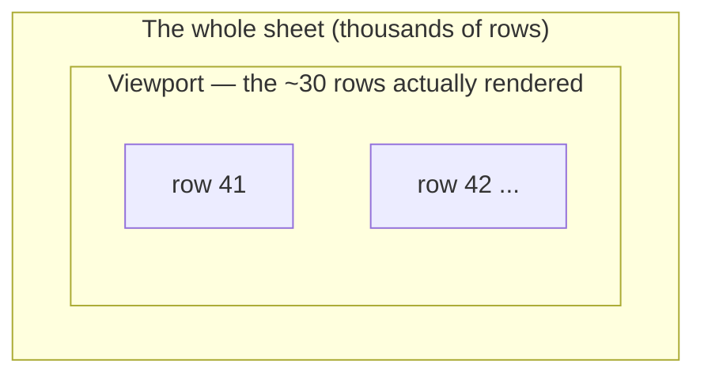

# 🦴 The Skeleton: How an Office Suite Actually Works

> This is the educational heart of the project. Millions of people use
> spreadsheets every day; very few ever see what's underneath. This document
> walks through the actual skeleton — the same bones Microsoft Excel, Google
> Sheets, and Zoho stand on — using this repo's real, readable code as the
> specimen. Every file referenced here exists in `src/` and is unit-tested.

---

## 1. The spreadsheet is a tiny programming language

When you type `=SUM(A1:A3)*2` into a cell, you are writing a program. Excel
runs it; so does this project. The pipeline is the same one every compiler
uses:

**Step 1 — Tokenizer** ([`tokenizer.ts`](../src/engine/formula/tokenizer.ts)):
scans the text character by character and groups it into *tokens*: numbers,
strings, cell references, operators, function names. This is where we found
BUG-001: `LOG10` looks exactly like a cell reference (column `LOG`, row `10`)!
The fix — peek ahead for a `(` — is the kind of edge case Excel solved decades
ago and every clone must rediscover.

**Step 2 — Parser** ([`parser.ts`](../src/engine/formula/parser.ts)): turns the
flat token list into a tree that encodes *precedence* — why `1+2*3` is 7, not
9\. The subtle part is matching Excel exactly. Excel says `-2^2 = 4` (the minus
binds first); mathematics says −4. We follow Excel, and a unit test pins that
decision forever.

**Step 3 — Evaluator** ([`evaluator.ts`](../src/engine/formula/evaluator.ts)):
walks the tree and computes a value. Errors are *values* here, not exceptions —
`#DIV/0!` flows through `=A1+1` and through `SUM()` ranges exactly like a
number would. That single design decision (errors as first-class values) is
what makes Excel's error behavior possible.

## 2. The dependency graph — the real magic of a spreadsheet

Change one cell and a thousand formulas update. How? Every formula's references
form a **dependency graph**, and the engine walks it in the right order:

Three hard problems live here, and all three bit us during development:

1. **Cycles.** `A1=B1`, `B1=A1` would loop forever. We detect "back-edges"
   during evaluation and return `#CYCLE!` ([`sheet.ts`](../src/engine/grid/sheet.ts)).
2. **Depth.** A running-total column 1,000 rows deep is a 1,000-link chain. Our
   first evaluator recursed once per link and **blew the call stack** (BUG-011,
   found by the Phase-7 audit). The fix — an iterative, explicit-stack
   topological evaluation — is precisely how production engines do it.
3. **Rewriting.** Insert a row and every `A5` below it must become `A6`; delete
   a referenced row and formulas must show `#REF!`. We rewrite the actual
   syntax trees ([`mutations.ts`](../src/engine/grid/mutations.ts)) rather than
   doing string surgery — string replacement breaks on cases like `AA1` vs `A1`.

## 3. Why the grid doesn't melt: virtualization

A million-cell sheet cannot put a million DOM elements on screen. The grid
([`Grid.tsx`](../src/ui/components/Grid.tsx)) renders **only the rows visible
in the viewport** (plus a small overscan) and repositions them as you scroll:

Frozen panes are the same trick with a twist: frozen rows/columns get their
scroll offset added back so they appear pinned while everything else moves.

## 4. Editors are trees too: the document module

The Docs editor doesn't store HTML strings — it stores a **structured tree**
(ProseMirror, via TipTap). Bold isn't `<b>` tags; it's a *mark* on a text node.
That structure is what makes reliable `.docx` export possible: we walk the tree
([`docModel.ts`](../src/io/docModel.ts)) and rebuild each paragraph, heading,
list, and table as OOXML — the actual format inside a `.docx` file (a `.docx`
is really a ZIP of XML files).

## 5. Everything else is plumbing — but plumbing with sharp edges

- **CSV** looks trivial and isn't: quoted fields, embedded commas, embedded
  *newlines*, doubled quotes. [`csv.ts`](../src/io/csv.ts) implements RFC-4180
  properly, with tests for each trap.
- **Undo/redo** is snapshot-based: every mutation pushes a serialized project
  state onto a bounded stack (100 steps). Simple, correct, and how many real
  apps start; Excel uses finer-grained command objects for memory efficiency.
- **Autosave** debounces writes to `localStorage`; a `.aioffice` file is just
  the same snapshot, downloadable.
- **The macro runtime** exposes a small `sheet` API to user JavaScript — the
  same architectural idea as Office Scripts.

## 6. What surprised us (honest lessons)

- **The tests found bugs the demos never would.** Type-to-edit silently ate the
  first keystroke (`=A1` became text `A1`) — every mouse-driven demo passed;
  the keyboard-only audit failed instantly. (BUG-013)
- **"It compiles and renders" ≠ "it works".** The Freeze button shipped a whole
  phase doing literally nothing (BUG-006) because the state existed but no code
  read it. Only an adversarial audit caught it.
- **Excel's weirdness is load-bearing.** `-2^2=4`, errors that flow through
  SUM, `#REF!` after deletes — these look like quirks but users' sheets depend
  on them. Cloning the behavior means cloning the decisions, not just the UI.

> Every bug above is logged with root cause and a guarding test in
> [`BUGLOG.md`](../BUGLOG.md). That's the honest record of what it takes.
