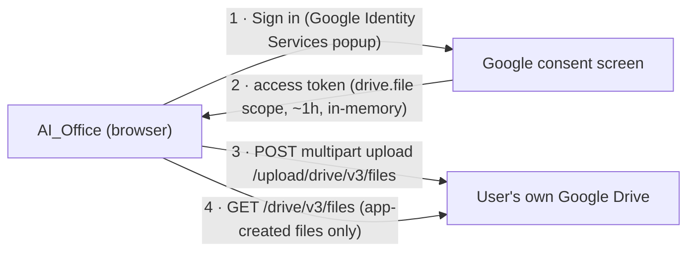

# ☁️ Google Drive integration — design (ready to build)

> **Status: designed, not yet wired in.** Everything below is implementable
> with no server of our own — but it requires one thing only the project owner
> can create: a free **Google OAuth Client ID**. And it can only be *verified*
> by a real person logging into a real Google account in a browser, which is
> why it isn't blindly implemented and claimed as working. This page is the
> complete plan so that wiring it up is a short, safe step.

## What the feature does

- **Save to Drive** — push the current `.aioffice` project (or any export:
  `.xlsx`, `.docx`, `.md`, `.csv`) straight into the user's own Google Drive.
- **Open from Drive** — pick a previously saved file and load it.
- The existing local Download options remain; Drive is an *addition*.

## Why it fits our security rules (docs/SECURITY.md)

This is the rare online feature that keeps the local-first promise:

1. **No server of ours.** The browser talks directly to Google's API with a
   token Google issues to *the user* after *their* consent screen. We store
   nothing, see nothing, and have no database to breach.
2. **Least privilege by scope.** We request only `drive.file` — the narrowest
   Drive scope: the app can touch **only files it created or the user
   explicitly picked**, never the rest of their Drive. A compromised app
   couldn't read their other documents.
3. **No secrets in the bundle.** An OAuth *Client ID* is public by design
   (it's an identifier, not a key); there is no client secret in this flow
   (browser apps use the token flow, PKCE-style). Rule 5 holds.
4. **Tokens stay in memory.** Access tokens live for ~1 hour and are kept in
   a JS variable — never written to `localStorage` — so an XSS-class bug can't
   harvest a long-lived credential.

## Architecture

Implementation is ~150 lines, no SDK bundle needed:
- Load Google Identity Services (`https://accounts.google.com/gsi/client`) on
  demand when the user clicks "Save to Drive" (keeps the offline bundle clean).
- `google.accounts.oauth2.initTokenClient({client_id, scope: 'https://www.googleapis.com/auth/drive.file'})`.
- Upload: `fetch('https://www.googleapis.com/upload/drive/v3/files?uploadType=multipart', ...)`
  with the JSON metadata + file bytes; update-in-place via `PATCH` on the
  stored file ID.
- List/open: `GET https://www.googleapis.com/drive/v3/files?q=...` (the
  `drive.file` scope automatically restricts results to our files).
- Config: the Client ID goes in a single constant / `.env` entry; when unset,
  the Drive buttons hide (PWA/offline builds unaffected).

## The 10-minute setup only you can do (free)

1. console.cloud.google.com → create a project (e.g. "AI-Office").
2. "APIs & Services" → enable **Google Drive API**.
3. "OAuth consent screen" → External → add yourself as a test user.
4. "Credentials" → **Create OAuth Client ID** → type *Web application* →
   add your app's URL(s) as *Authorized JavaScript origins*
   (e.g. `http://localhost:3000` and your hosted URL).
5. Copy the Client ID (ends in `.apps.googleusercontent.com`) — that's all we
   need. There is no billing and no charge for this usage tier.

## Constraints to know up front (honesty section)

- **Not for the single-file/offline builds.** OAuth requires a real `http(s)`
  origin registered with Google; `file://` (AI_Office.html) and unregistered
  LAN IPs can't sign in. Drive is a hosted-web/PWA feature.
- **Consent screen shows "unverified app"** until Google reviews the app —
  fine for personal/educational use (you add yourself as a test user).
- **Testing needs a human.** The Google login popup can't be automated in our
  CI; the E2E plan is a mocked-fetch unit layer plus a manual checklist.

## When you're ready

Say "wire up Google Drive, here's my Client ID: …" — the module, the two
toolbar buttons (Save to Drive / Open from Drive), the mocked unit tests, and
the manual verification checklist land in one commit, and you test the live
login on your machine.
