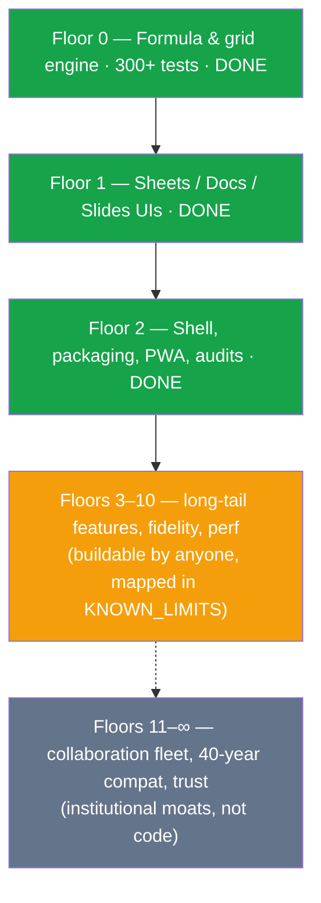

# ⚖️ AI_Office vs Microsoft Office — the honest ledger

> One person + one AI assistant (Claude) built this in days. Microsoft has built
> Office since 1985 with thousands of engineers. This document is the honest
> accounting of that gap: what an advanced AI **could** replicate quickly, what
> it **couldn't**, and what would take *years regardless of how smart the AI
> is* — because the barrier isn't intelligence, it's accumulated engineering,
> infrastructure, and time.

## Scorecard at a glance

| Capability | Microsoft Office | AI_Office | Verdict |
|---|---|---|---|
| Formula engine core (parse/evaluate/errors) | ✅ | ✅ 140+ functions, Excel-style semantics | **Replicated in part** — the educational skeleton is genuinely here |
| Function library breadth | ~500 functions | 140+ | **Partial** — the *long tail* (statistical, financial, engineering) is sheer volume, addable over time |
| Recalculation at scale | Millions of cells, multithreaded native code | 10k cells fast; single-threaded JS | **Partial** — architecture is right (dependency-ordered), raw horsepower isn't |
| Grid UX (edit, undo, freeze, formats, sort) | ✅ | ✅ | **Replicated** at core level |
| Charts | Dozens of types, styling engine | Line/bar | **Skeleton only** |
| Rich text documents | Full word processor | Solid editor + `.docx` export subset | **Partial** |
| Pagination, headers/footers, TOC, track changes | ✅ | ❌ | **Not done** — each is a subsystem of its own |
| Presentations | Animations, transitions, presenter view | Layouts, themes, present mode, PDF | **Skeleton + working core** |
| File format fidelity (.xlsx/.docx/.pptx round-trip) | Reference implementation | Values + formulas + basic structure | **The single biggest moat** — see below |
| Real-time co-authoring | ✅ (OT/CRDT + service fleet) | ❌ | **Infrastructure moat** — needs servers, not just code |
| 40 years of backwards compatibility | ✅ | n/a | **Time moat** — cannot be compressed |
| Offline-first, installable, tiny | Large install | 1.4 MB single file / PWA | **We win this one** 🙂 |

## What Fable 5 replicated quickly (and why that's remarkable)

The parts textbooks call "hard CS" fell fast: a tokenizer/parser/evaluator with
Excel's exact precedence quirks, dependency-graph recalculation with cycle
detection, reference rewriting on structural edits, a virtualized grid, an
iterative evaluator that survives 1,000-deep formula chains. These are
*well-defined problems*, and modern AI is extremely strong on well-defined
problems — including writing the 300+ unit tests that police them.

## What Microsoft still does better — and *why* AI can't shortcut it

**1. The file formats are the real fortress.** OOXML (`.xlsx`/`.docx`/`.pptx`)
is thousands of pages of specification, plus decades of undocumented behavior
that real files in the wild depend on. Excel opens a malformed 2003-era file
*the same wrong way it always did*, because someone's payroll depends on that.
Compatibility isn't intelligence — it's an archive of decisions you can only
learn by processing billions of real files. An AI can implement the spec; it
cannot compress the archaeology.

**2. Performance engineering at the extreme.** Excel's recalc engine is
multithreaded native code with 30 years of profiling behind it — smart recalc
chains, memory-packed cell stores, GPU-accelerated rendering. Our engine is
*architecturally* correct (dependency-ordered, cached, iterative) but a JS
single thread will not process a 10-million-cell financial model. Closing that
gap is years of systems work, not a smarter prompt.

**3. Collaboration is a fleet, not a feature.** Real-time co-authoring means
conflict-resolution algorithms (OT/CRDT) *plus* a globally distributed service
with identity, permissions, and sync — infrastructure you operate, not code you
write once. No local-first app can conjure it.

**4. The long tail is the product.** Pivot tables, conditional formatting,
data validation, Solver, Power Query, accessibility narration, RTL scripts,
mail merge, track changes, macros recorded from UI actions… each is
individually buildable — *that's the trap*. There are hundreds, they interact,
and the interactions are where the person-centuries went. Our
[`KNOWN_LIMITS.md`](../KNOWN_LIMITS.md) is a candid list of exactly these cuts.

**5. Trust is earned in decades.** Enterprises run on Office because of
security review processes, compliance certifications, and a 40-year track
record. No codebase — however good — ships with that.

## So what *is* this project, honestly?

The **first two floors of the skyscraper**, built correctly: real foundations
(engine, tests, audits), real load-bearing walls (three working editors), real
utilities (packaging, offline, persistence). Enough that anyone can walk in,
see how the building stands up, and — because it's MIT-licensed and documented
floor by floor — keep building. That was the goal; parity never was.

